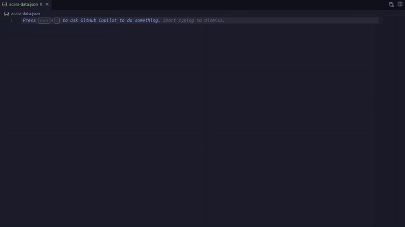

<h1 align='center'>
  Scrapes data from <a href='https://www.acara.org.ar/guia-oficial-de-precios.php'>ACARA's official price guide</a>.
</h1>

<div align='center'>
  
</div>

<p></p>

## Install dependencies

```bash
  ~$ npm install
```

## Environment variables

```bash
  # Copy the .env.example file to .env.local
  ~$ cp .env.example .env.local
```

Open the .env.local file and set the environment variables. Scraperapi API key is optional.

## Compile and run the project

```bash
  # Compile the project
  ~$ npm run build

  # Run the project
  ~$ npm run start
```
